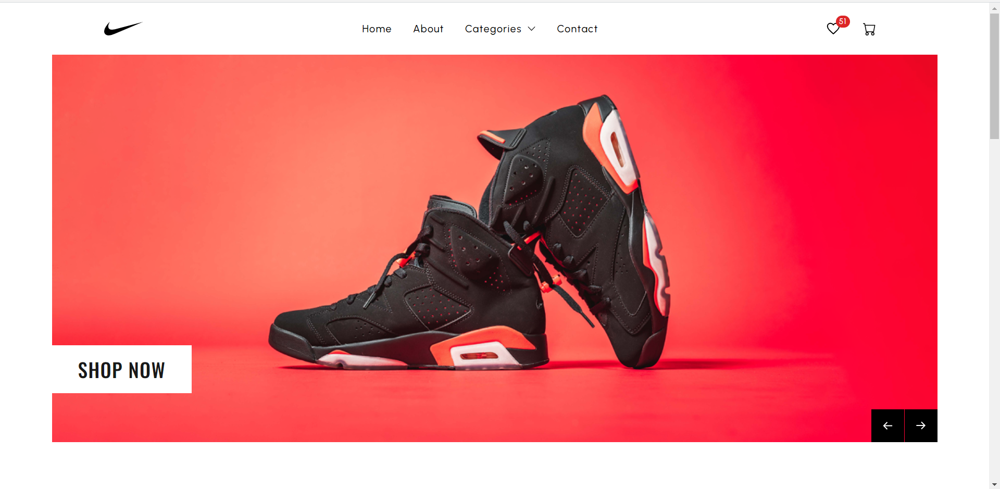

# Nike Shoe Store App Clone

Welcome to the Nike Shoe Store App Clone! This is a clone of the Nike shoe store website built using Next.js.

## Demo

Check out the live demo of the app: [Live Demo](https://shoe-store-frontend-cyan.vercel.app/)

## Features

- Browse and search for Nike shoes.
- View shoe details, prices, and availability.
- Add items to your cart and proceed to checkout.

## Technologies Used

- Next.js
- React
- redux toolkit
- tailwind CSS
- RESTful API 

## Installation

1. Clone the repository: `git clone https://github.com/your-username/nike-shoe-store.git`
2. Navigate to the project directory: `cd nike-shoe-store`
3. Install dependencies: `npm install`

## Usage

1. Start the development server: `npm run dev`
2. Open your browser and go to: `http://localhost:3000`

## Contributing

Contributions are welcome! If you find any bugs or want to improve the app, feel free to submit a pull request.

